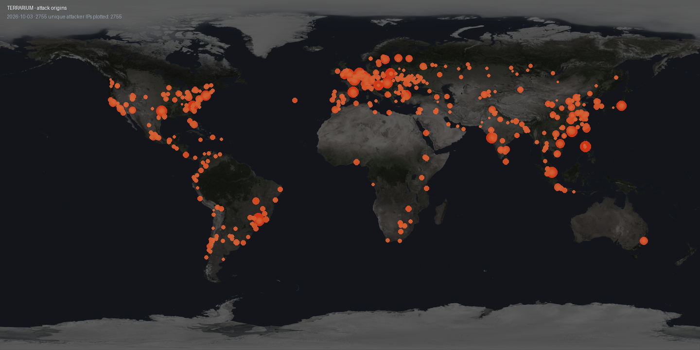

# Attack map

Updated daily from the deception grid.

| Metric | Count |
|---|---|
| Unique attacker IPs | 2755 |
| SSH brute-forcers | 1171 |
| HTTP probers | 1345 |
| Jenkins probers | 459 |

## Top origin countries (by events)

| Country | Events |
|---|---|
| US | 929557 |
| NL | 154826 |
| FR | 73968 |
| IN | 17076 |
| AD | 13027 |
| SG | 7313 |
| BR | 6613 |
| PL | 4297 |

_Last updated: 2026-10-03 UTC_
